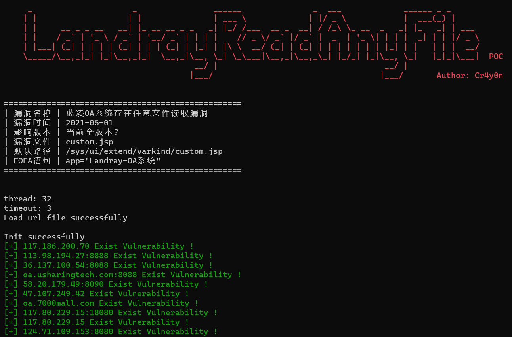
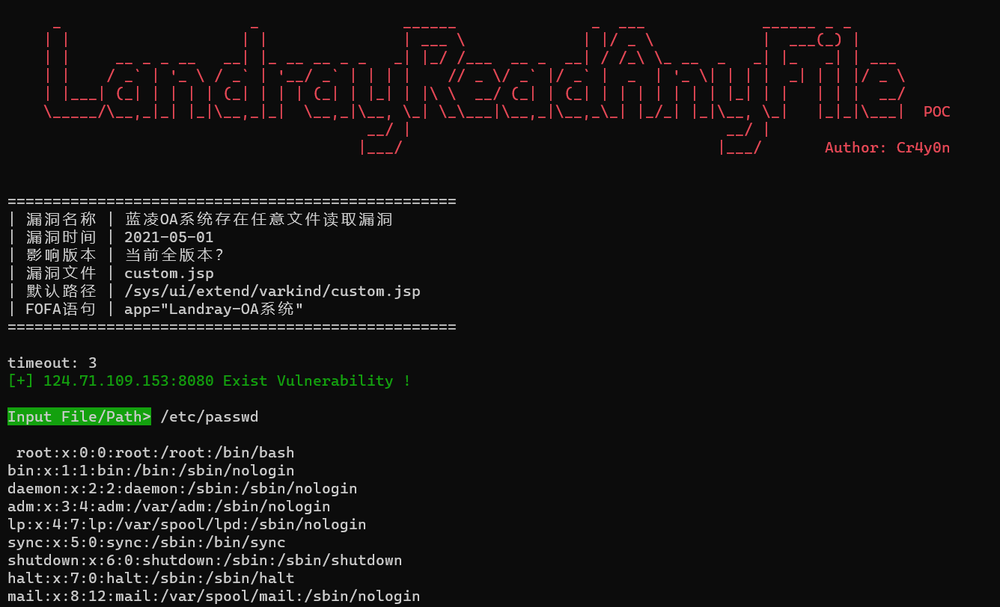

# LandrayReadAnyFile

Landray 蓝凌OA 存在任意文件读取漏洞，可读取服务器任意文件和目录。

本POC可批量扫描目标，EXP可直接利用漏洞独取任意文件。

## 环境

Python：>= Python 3.7

OS：ALL

## 获取

clone

```
git clone https://github.com/Cr4y0nXX/LandrayReadAnyFile.git
```

## POC

使用多线程方式批量对目标url进行漏洞探测，并输出结果。

### Usage

注意：从本POC开始t代表thread线程，T代表timeout请求超时

```
LandrayOAReadAnyFile_POC.py [-h] [-f FILE] [-t THREAD] [-T TIMEOUT] [-o OUTPUT]

optional arguments:
  -h, --help            show this help message and exit
  -f FILE, --file FILE  The url file, default is ./url.txt   目标url文件，一行一个
  -t THREAD, --thread THREAD
                        Number of thread, default is 32   线程数，默认32
  -T TIMEOUT, --Timeout TIMEOUT
                        request timeout(default 3)   请求超时，默认3秒
  -o OUTPUT, --output OUTPUT
                        Vuln url output file, default is
                        ./2021-03-24_11-10-20.txt   输出所有存在漏洞的url，默认以当前时间为文件名
```

所有参数均为可选参数，都有默认值，但必须有目标url文件，一行一个目标地址。

### 演示

```
python ApacheSolrReadAnyFile_POC.py -f ./1.txt
```



## 🚀EXP1  readAnyFile

单线程的方式，每次对一个目标进行验证和利用，若存在漏洞可输入文件或路径得到结果。

### Usage

```
LandrayOAReadAnyFile_EXP.py [-h] -u URL [-t TIMEOUT]

optional arguments:
  -h, --help            show this help message and exit
  -u URL, --url URL     The target address, (ip:port) or url    指定目标url
  -t TIMEOUT, --timeout TIMEOUT
                        request timeout(default 3)    指定请求超时，默认3秒
```

-u为必选参数。

### 演示

```
python ApacheSolrReadAnyFile_EXP.py -u ip:port
```



也可输入目录，得到目录下所有文件。

## 🚀EXP2  passExport

多线程读取指定服务端密码文件，获取后台管理员密码。

### 演示

```
python ApacheSolrReadAnyFile_EXP_passExport.py -f 1.txt
```


即可得到所有存在漏洞的系统管理员密码，并输出到文件。

